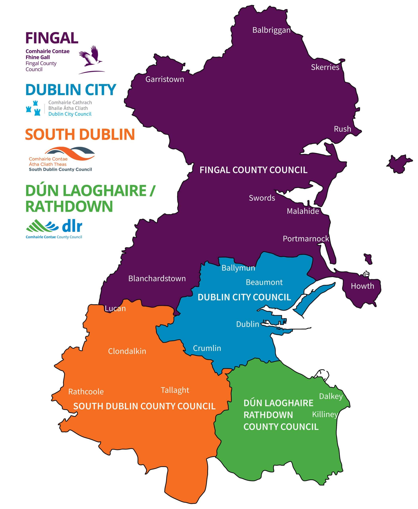
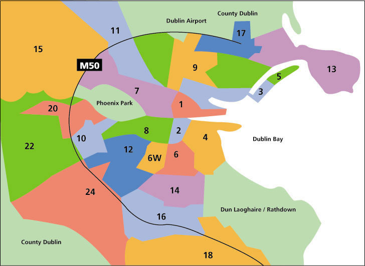
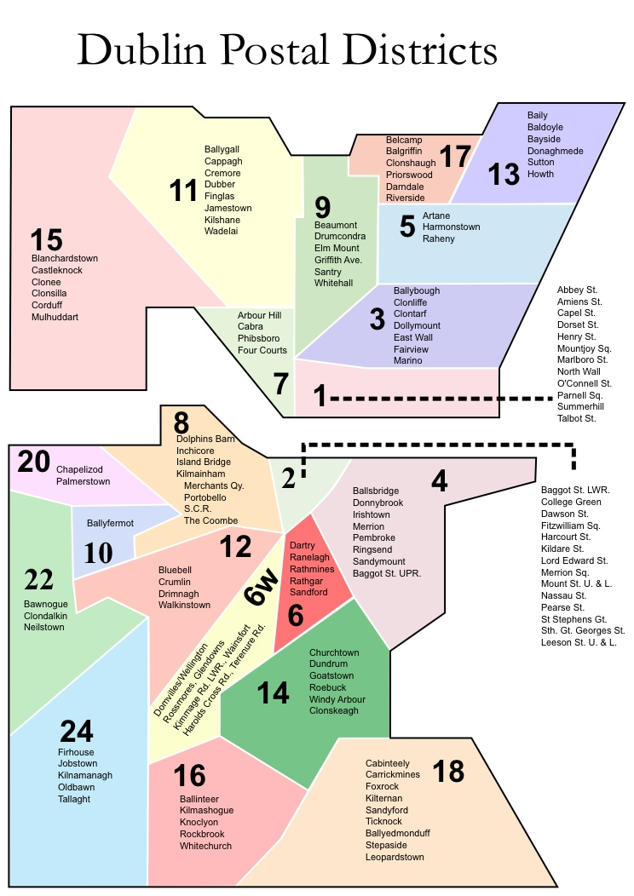
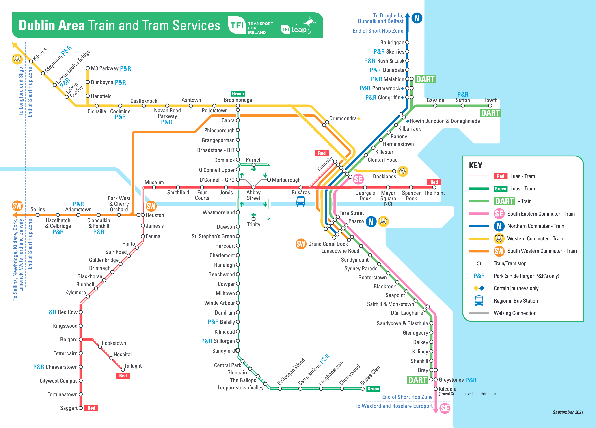

# ดับลิน

"ดับลิน" เป็นทั้งชื่อของเขตเมืองหลวงหรือกรุงดับลิน (Dublin City)
และเคาน์ตีดับลิน (County Dublin หรือเขียนย่อว่า Co. Dublin)

- เคาน์ตี เป็นหน่วยการปกครองหลักของไอร์แลนด์
  ถ้าเทียบกับประเทศไทยจะคล้าย "จังหวัด"
  (อย่างไรก็ตามคำว่า "province" ในบริบทของไอร์แลนด์จะมีความหมายอีกแบบ)
- เนื่องจากดับลินเป็นเคาน์ตีขนาดใหญ่ ประชากรเกือบ 30% ของประเทศอยู่ในเคาน์ตีนี้
  เคาน์ตีดับลินจึงแบ่งเขตการปกครองย่อยออกเป็นอีก 4 เขต
  และแต่ละเขตมีสภาท้องถิ่น (Council) ของตัวเอง (เรียงจากเหนือไปใต้) คือ
  - Fingal (สนามบินนานาชาติดับลินอยู่ในเมืองนี้)
  - Dublin City (กรุงดับลิน มหาวิทยาลัยเกือบทั้งหมดอยู่ในบริเวณนี้)
  - South Dublin
  - Dún Laoghaire–Rathdown

## กรุงดับลิน (Dublin City)

การรู้ชื่อย่านจะช่วยในการค้นหาบ้าน
ทำให้พอจะรู้ตำแหน่งที่ต้ัง การเดินทาง และค้นหาข้อมูลอื่นๆ ต่อได้
(ดูแผนที่รถไฟได้ที่ท้ายหน้านี้)

การเรียกชื่อย่านภายในกรุงดับลิน วิธีหนึ่งที่นิยมคือการเรียกตามเขตไปรษณีย์
(Dublin 1, Dublin 2 หรือย่อว่า D1, D2)

- เขตไปรษณีย์นี้จะแบ่งกรุงดับลินเป็นสองส่วนด้วยแนวแม่น้ำ Liffey
- เหนือแม่น้ำจะเป็นเลขคี่ ใต้แม่น้ำจะเป็นเลขคู่
- เขตใจกลางของดับลินคือเขต D1 และ D2 ซึ่งอยู่ตรงข้ามกันคนละฝั่งแม่น้ำ
  และเป็นที่ตั้งของสถานที่ราชการและสถานที่ท่องเที่ยวจำนวนมาก
- เลขเขตไปรษณีย์อื่นๆ จะมีลักษณะเป็นวงแหวนออกไปจาก D1 และ D2
  โดยตัวเลขโดยทั่วไปแล้ว ยิ่งเลขน้อยก็จะหมายถึงว่ายิ่งใกล้ D1 หรือ D2
- เขต D7 และ D8 เป็นเขตที่มีหอพักนักศึกษาเอกชนจำนวนมาก

### สถานที่สำคัญ สถานศึกษา และเขตไปรษณีย์

- สถานีรถไฟหลักของดับลิน ที่เป็นจุดจอดของรถไฟระหว่างเมือง
  มี 3 แห่งในบริเวณใจกลาง
  คือ Dublin Connolly (D1), Dublin Pearse (D2) และ Dublin Heuston (D8)
- สถานีกลางสำหรับรถโดยสารระหว่างเมือง (Busáras) อยู่ใน D1
  แต่จุดจอดรถโดยสารจะกระจายมาอีกฝั่งของแม่น้ำใน D2 ด้วย
- Dublin City University, Glasnevin Campus, Dublin 9
- National College of Art and Design, Dublin 8
- RCSI University of Medicine and Health Sciences, Dublin 2
- Trinity College Dublin, Dublin 2
- TU Dublin, Grangegorman Campus, Dublin 7
- TU Dublin, Tallaght Campus, Dublin 24
- University College Dublin, Belfield, Dublin 4
- UCD Michael Smurfit Graduate Business School, Blackrock, Co. Dublin, A94 XF34
- Dún Laoghaire Institute Of Art Design + Technology (IADT), Dún Laoghaire, Co. Dublin, A96 KH79

## การเดินทาง

- Luas คือรถราง
- DART เป็นรถไฟดีเซลสัญจรที่ขนส่งคนเข้าและออกจากตัวเมือง (commuter train)
  โดยวิ่งเลียบเมืองชายฝั่ง และเชื่อมต่อกับระบบรถไฟระหว่างเมืองของ Irish Rail
- นอกจาก DART ยังมี commuter train ที่วิ่งไปเมืองที่อยู่เข้าไปฝั่งแผ่นดิน
  เช่น Parkwest, Kildare, Maynooth

## อ้างอิง

- ภาพแผนที่ดับลินตามเขตไปรษณีย์
  จาก วิพีเดีย [List of Dublin postal districts](https://en.wikipedia.org/wiki/List_of_Dublin_postal_districts)
  และ <https://tivinairlanda.wordpress.com/dublin-map/>
- แผนที่การเดินทางในดับลิน
  จาก [Transport for Ireland](https://www.transportforireland.ie/plan-a-journey/network-maps/)
  (ดูสายรถเมล์และการโดยสารอื่นๆ ได้ที่เว็บไซต์)
