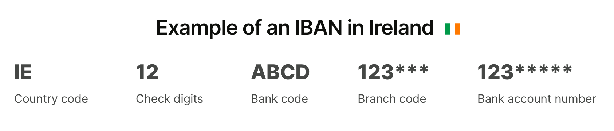
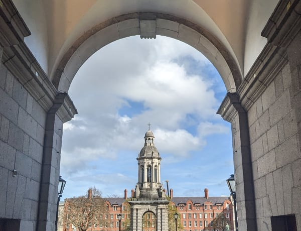

# ข้อมูลการเดินทางมาศึกษาต่อไอร์แลนด์

[thaisocireland.github.io/docs](https://thaisocireland.github.io/docs/)

จัดทำโดย[เพจ](https://www.facebook.com/thaistudentsinireland/)/[กลุ่มเฟซบุ๊ก นักเรียนไทยในไอร์แลนด์](https://www.facebook.com/groups/thaisocietyireland/) - ปรับปรุงล่าสุด 25 ส.ค. 2024

- [ข้อมูลเกี่ยวกับดับลิน](./dublin.md)

## ข้อมูลทั่วไป

- **[Education in Ireland](https://www.educationinireland.com/en/)**
  - เว็บไซต์ส่งเสริมการศึกษาในไอร์แลนด์ จัดทำโดยรัฐบาลไอร์แลนด์
  - มีข้อมูลทั่วไปเกี่ยวกับหลักสูตร ค่าใช้จ่าย การเรียน การทำงานระหว่างเรียน
- **[Citizens Information](https://www.citizensinformation.ie/)**
  - ข้อมูลการเข้าเมือง ใบอนุญาตพำนัก การรักษาพยาบาล สิทธิของผู้เช่าบ้าน สิทธิแรงงาน
  - ไม่ว่าจะหาอะไร ลองที่เว็บไซต์นี้ก่อนเป็นแห่งแรก
  - ดำเนินงานโดยการสนับสนุนของรัฐบาลไอร์แลนด์
    ข้อมูลทุกอย่างจะมีลิงก์ไปยังหน้าเว็บหรือเอกสารที่เกี่ยวข้องของหน่วยงานรัฐที่รับผิดชอบโดยตรง
- **[Irish Council for International Students](https://www.internationalstudents.ie/)**
  - มีข้อมูลด้านสิทธิต่างๆ ที่เกี่ยวกับนักเรียนนานาชาติ เช่น สิทธิเกี่ยวกับที่พัก การทำงาน
    การเลือกปฏิบัติ การถูกปฏิเสธวีซ่า
  - ICOS เป็นองค์กรไม่แสวงกำไรที่มีสมาชิกประกอบด้วยสถาบันอุดมศึกษาและองค์กรนักศึกษาในไอร์แลนด์
- สำหรับข้อมูลเฉพาะสำหรับสถานศึกษา ให้ดูที่เว็บไซต์ของสถานศึกษา
  หรือเว็บไซต์/สื่อสังคมออนไลน์ของสหภาพหรือสโมสรนักศึกษา

## หาที่เรียน

- การเรียนในไอร์แลนด์นานกว่า 90 วัน ไม่ว่าจะในระดับมหาวิทยาลัยหรือโรงเรียนภาษาอังกฤษ จะต้องขอใบอนุญาตพำนัก และการจะขอใบอนุญาตพำนักได้ จะต้องเลือกหลักสูตรจาก[รายการ Interim List of Eligible Programmes (ILEP)](https://www.irishimmigration.ie/coming-to-study-in-ireland/what-are-my-study-options/a-third-level-course-or-a-language-course/) เท่านั้น

  

- ระบบการศึกษาในไอร์แลนด์ทั้งหมด ทั้งสายสามัญและสายวิชาชีพ จะอยู่ภายใต้กรอบ [National Framework of Qualifications](https://www.qqi.ie/what-we-do/the-qualifications-system/national-framework-of-qualifications) ซึ่งมี 10 ระดับ
  - ในรายละเอียดทุกหลักสูตรจะมีบอกว่าหลักสูตรนี้ NFQ Level อะไร
  - การศึกษาที่เรียกว่า "Higher Education" หรืออุดมศึกษาในไอร์แลนด์ จะเริ่มตั้งแต่ระดับ 6
  - ระดับ 6 - **Advanced Certificate / Higher Certificate** เทียบเท่า ประกาศนียบัตรชั้นสูง (ปวส.) ของไทย
  - ระดับ 7 - **Ordinary Bachelor Degree** (โดยทั่วไปเรียน 3 ปี) เทียบเท่า ปริญญาตรีของไทย
  - ระดับ 8 - **Higher Diploma / Honour Bachelor Degree** (โดยทั่วไปเรียน 4 ปี) เทียบเท่า ปริญญาตรีของไทย
  - ระดับ 9 - **Post-Graduate Diploma / Masters Degree** ปริญญาโท
  - ระดับ 10 - **Doctoral Degree / Higher Doctorate** ปริญญาเอก
- โรงเรียนภาษาอังกฤษ
  - ตรวจสอบโรงเรียนภาษาอังกฤษที่ได้รับการรับรองจาก Accreditation and Co-ordination of English Language Services (ACELS) ได้ที่ <https://www.acels.ie>
  - ปี 2024 เป็นช่วงเปลี่ยนผ่านไปสู่ระบบการรับรองคุณภาพแบบใหม่ที่ชื่อว่า [International Education Mark (IEM)](https://www.qqi.ie/what-we-do/quality-assurance-of-education-and-training/what-is-the-international-education-mark) โรงเรียนภาษาอังกฤษหลังจากนี้ ถ้าจะรับนักเรียนจากนอกเขตเศรษฐกิจยุโรป (เช่นจากประเทศไทย) จะต้องได้รับตรา IEM
- มหาวิทยาลัยทั้งหมดในไอร์แลนด์เป็นมหาวิทยาลัยรัฐ
  - [Dublin City University](https://www.dcu.ie/)
  - [National University of Ireland](https://www.nui.ie/)
    - [Maynooth University](https://www.maynoothuniversity.ie/)
    - [University of Galway](https://www.universityofgalway.ie/)
    - [University College Cork](https://www.ucc.ie/)
    - [University College Dublin](https://www.ucd.ie/)
  - [Trinity College Dublin](https://www.tcd.ie/) (University of Dublin)
  - [University of Limerick](https://www.ul.ie/)
  - [University of Medicine and Health Sciences](https://www.rcsi.com/) (Royal College of Surgeons in Ireland) (ในเมือง Dublin)
  - [Atlantic Technological University](https://www.atu.ie/) (ในเมือง Galway-Mayo, Sligo และ Letterkenny)
  - [Munster Technological University](https://www.mtu.ie/) (ในเมือง Cork และ Tralee)
  - [South East Technological University](https://www.setu.ie/) (ในเมือง Carlow และ Waterford)
  - [Technological University Dublin](https://www.tudublin.ie/)
  - [Technological University of the Shannon: Midlands Midwest](https://tus.ie/) (ในเมือง Athlone และ Limerick)
- สถาบันอุดมศึกษาอื่น ทั้งของรัฐและเอกชน เช่น
  - [Dundalk Institute of Technology](https://www.dkit.ie/)
  - [Dún Laoghaire Institute of Art, Design and Technology (IADT)](https://iadt.ie/)
  - [National College of Art and Design (NCAD)](https://www.ncad.ie/) (เป็น recognised college ของ University College Dublin)
  - [The Lir National Academy of Dramatic Art](https://www.thelir.ie/) (เป็นส่วนหนึ่งของ Trinity College Dublin)
  - [Gaiety School of Acting](https://gaietyschool.com/) (มีหลักสูตร [MA Theatre Practice](https://hub.ucd.ie/usis/!W_HU_MENU.P_PUBLISH?p_tag=PROG&MAJR=Z243) ร่วมกับ University College Dublin)
  - [Burren College of Art](https://www.burrencollege.ie/) (มีหลักสูตร [MFA in Studio Art](https://www.universityofgalway.ie/courses/taught-postgraduate-courses/fine-art-studio-art.html) ร่วมกับ University of Galway)
  - [Royal Irish Academy of Music](https://www.riam.ie/)
  - [Mary Immaculate College](https://www.mic.ul.ie/) (วิทยาลัยด้านการศึกษาและศิลปศาสตร์ เป็นส่วนหนึ่ง University of Limerick)
  - [Marino Institute of Education](https://www.mie.ie/) (เป็น associated college ของ Trinity College Dublin)
  - [National College of Ireland](https://www.ncirl.ie/)
  - [Dublin Business School](https://www.dbs.ie/)
  - [Griffith College](https://www.griffith.ie/)
  - [King's Inn](https://www.kingsinns.ie/) (โรงเรียนกฎหมายของเนติบัณฑิตยสภาไอร์แลนด์)

- NFQ 10 ระดับของไอร์แลนด์ สามารถเทียบกับ [European Qualifications Framework (EQF) 8 ระดับ ของสหภาพยุโรป](https://europass.europa.eu/en/europass-digital-tools/european-qualifications-framework) ได้ตามแผนภาพด้านล่างนี้ ผู้จบการศึกษาจากระบบ NFQ/EQF (ประเทศในสหภาพยุโรป และอีก 11 ประเทศ รวมถึงนอร์เวย์ สวิตเซอร์แลนด์ และตุรกี) สามารถศึกษาต่อในระดับต่อไปภายใต้ NFQ/EQF ได้ทันที

  

- สำหรับผู้มีใบอนุญาตพำนักประเภท Stamp 4, Stamp 5, หรือ Stamp 6 ที่พำนักในไอร์แลนด์มาแล้วไม่ต่ำกว่า 3 ปี สามารถสมัครเรียนหลักสูตรในโครงการ Springboard+ และโครงการ Human Capital Initiative Pillar 1 ของรัฐบาลได้ ทั้งนี้หลักสูตรทั้งหมด เรียนฟรี หรือมีส่วนลดสูงสุดถึง 90% มีทั้งหลักสูตรประกาศนียบัตร ปริญญาตรี และปริญญาโท ดูข้อมูลที่ [SpringboardCourses.ie](https://springboardcourses.ie/)

## ทุนการศึกษา / ทุนวิจัย

### เฉพาะไอร์แลนด์

- **[Government of Ireland – International Education Scholarships](https://hea.ie/policy/internationalisation/goi-ies/)**
- **[Irish Research Council](https://www.educationinireland.com/en/)**
- **[Science Foundation Ireland](https://www.sfi.ie/)**
- **[CareersPortal Scholarship Explorer](https://careersportal.ie/scholarships/)**
  - รวมทุนการศึกษา และส่วนลดค่าเล่าเรียน เน้นหลักสูตรวิชาชีพ

- ติดตามเว็บไซต์และสื่อสังคมของมหาวิทยาลัย คณะ ศูนย์วิจัย และอาจารย์ในสาขาวิชาต่างๆ
  ในมหาวิทยาลัย สำหรับข่าวสารทุนการศึกษา ทุนวิจัย และทุนวิจัยระยะสั้น ที่จะมีประกาศตลอดปี

### ยุโรปและสหภาพยุโรป (รวมไอร์แลนด์ด้วย)

- **[Study in Europe](https://education.ec.europa.eu/study-in-europe/planning-your-studies/scholarships-and-funding)**
  - รวมทุนการศึกษา ทุนวิจัย และการสนับสนุนทางการเงินอื่นๆ จากหน่วยงานในสหภาพยุโรป
  - เลือกหน้า **[Ireland](https://education.ec.europa.eu/study-in-europe/countries/ireland)**
- **[EURAXESS ASEAN](https://euraxess.ec.europa.eu/worldwide/asean)**
  - รวมทุนวิจัยที่เป็นความร่วมมือระหว่างสหภาพยุโรปและอาเซียน

## ก่อนออกจากไทย

- **ซิมการ์ดไทย / eSIM**
  - ถ้าจะรักษาหมายเลขโทรศัพท์ที่ไทยเอาไว้ เช่นเพื่อรับ OTP
  แนะนำให้เปลี่ยนเป็นแบบเติมเงินก่อนจะเดินทางมาไอร์แลนด์
  - อายุของเงินที่เติมเข้าไปจะขยายออกไป 30 วันต่อการเติม 1 ครั้ง และสะสมได้สูงสุด 365 วัน
    ถ้าก่อนเดินทางแบ่งเติมครั้งละ 10-20 บาท 12 ครั้ง (สามารถทำได้ติดต่อกันในวันเดียวกัน)
    ก็จะได้เครดิตวัน 360 วัน โดยใช้เงิน 120-240 บาท
  - เมื่ออยู่ไอร์แลนด์แล้ว สามารถเติมเงินผ่านแอปได้
  - ให้ระวังการเผลอเปิด data roaming โดยไม่รู้ตัว
  - โทรศัพท์หลายรุ่น สามารถใช้ 2 ซิมได้ แต่ซิมที่ 2 ต้องเป็น eSIM - ถ้าต้องการให้ซิมไทยเป็น eSIM ก็ให้ไปทำที่สาขาก่อนออกเดินทาง
- **บัญชีธนาคารไทย**
  - บัญชีธนาคารที่ไม่มีการเคลื่อนไหว จะถูกเก็บค่ารักษาบัญชีรายเดือน
  ถ้าใช้แอปธนาคารจ่ายเงิน โอนเงิน หรือเติมเงินซิมมือถือครั้งละน้อยๆ เป็นครั้งคราว
  ก็จะทำให้บัญชีมีการเคลื่อนไหว และไม่ถูกเก็บค่าธรรมเนียม
  - ปัจจุบันถ้าจะโอนเงินตั้งแต่ 50,000 บาทต่อรายการ หรือ 200,000 บาทต่อวัน [จะต้องยืนยันตัวตนด้วยใบหน้า](https://www.tba.or.th/transfers-over-50000-must-scan-faces-starting-this-june/) ถ้าคิดว่าอาจมีเหตุจำเป็นต้องทำธุรกรรมดังกล่าว ก็ให้ไปยืนยันตัวตนที่สาขาเตรียมไว้ก่อน
- **NDID**
  - ถ้ามีแผนจะทำธุรกรรมออนไลน์ เช่น เปิดบัญชีธนาคาร เปิดบัญชีซื้อขายหลักทรัพย์
  ยื่นแบบภาษีออนไลน์ ระหว่างที่อยู่ไอร์แลนด์ แนะนำให้ลงทะเบียน National Digital ID (NDID)
  ของไทยก่อนเดินทาง เนื่องจากการลงทะเบียนครั้งแรกอาจต้องไปยืนยันตัวตนที่สาขาของธนาคาร (ติดต่อธนาคารที่เรามีบัญชีอยู่แล้วเพื่อสอบถามการลงทะเบียน NDID - ไม่มีค่าใช้จ่ายในการลงทะเบียน)
- **ใบขับขี่สากล**
  - ผู้มีใบขับขี่ของไทย สามารถทำใบขับขี่ระหว่างประเทศตามอนุสัญญาเจนีวา 1949
  และใช้หนังสือเดินทางไทยร่วมกับใบขับขี่ดังกล่าวในประเทศไอร์แลนด์ได้
  - ใบขับขี่ระหว่างประเทศนี้มีอายุ 1 ปี สามารถใช้ได้ในหลายประเทศ รวมถึงไอร์แลนด์และสหราชอาณาจักร
  - ทำได้ที่สำนักงานขนส่งจังหวัด ดูข้อมูลเพิ่มเติมที่
    [กรมการขนส่งทางบก](https://safedrivedlt.com/%E0%B8%97%E0%B8%B3%E0%B9%83%E0%B8%9A%E0%B8%82%E0%B8%B1%E0%B8%9A%E0%B8%82%E0%B8%B5%E0%B9%88/%E0%B9%83%E0%B8%9A%E0%B8%82%E0%B8%B1%E0%B8%9A%E0%B8%82%E0%B8%B5%E0%B9%88%E0%B8%AA%E0%B8%B2%E0%B8%81%E0%B8%A5/)
  - ใบขับขี่ระหว่างประเทศตามอนุสัญญาเวียนนา 1968 ที่มีอายุ 3 ปี ใช้ในไอร์แลนด์ไม่ได้

## การเข้าเมือง / วีซ่า

### ข้อมูลทั่วไปเกี่ยวกับใบอนุญาตเข้าเมืองและใบอนุญาตพำนัก

- การมาศึกษาในประเทศไอร์แลนด์จะต้องมี **ใบอนุญาตเข้าเมือง (วีซ่า)**
  เพื่อเดินทางเข้าประเทศในขั้นแรก
  ซึ่งโดยทั่วไปวีซ่านี้จะใช้พำนักอยู่ในไอร์แลนด์ได้ไม่เกินคราวละ 90 วัน
  - ในประเทศไทย ทำได้ที่[สถานเอกอัครราชทูตไอร์แลนด์ ประจำประเทศไทย](https://www.ireland.ie/en/thailand/bangkok/)
- ภายใน 90 วันหลังเข้าเมืองแล้ว จะต้องดำเนินการทำ
  **[ใบอนุญาตพำนัก (Irish Residence Permit - IRP)](https://www.irishimmigration.ie/registering-your-immigration-permission/information-on-registering/irish-residence-permit/)**
  เพื่อให้อยู่ต่อได้หลัง 90 วัน
  - IRP มีอายุประมาณ 1 ปี เมื่อหมดอายุแล้วสามารถขอต่ออายุได้
- การให้อนุญาตเข้าเมืองและการให้อนุญาตพำนักในไอร์แลนด์
  เป็นกิจการของ[กระทรวงยุติธรรมและความเท่าเทียม (Department of Justice and Equality)](https://www.gov.ie/en/policy-information/c8b4e-immigration/)
- ผู้ถือหนังสือเดินทางไทย ที่มีวีซ่าท่องเที่ยวระยะสั้นของสหราชอาณาจักร (UK)
  [สามารถใช้วีซ่าดังกล่าวเดินทางเข้าไอร์แลนด์ได้](https://www.citizensinformation.ie/en/moving-country/visas-for-ireland/visa-requirements-for-entering-ireland/#cdc9fd) -
  แต่จะต้องเดินทางเข้า UK ก่อนจะเดินทางไปไอร์แลนด์
  - จำนวนวันที่อยู่ในไอร์แลนด์ได้จะนับต่อเนื่องกับวันที่อยู่ใน UK ตามเงื่อนไขของ
    [Short Stay Visa Waiver Programme](https://www.irishimmigration.ie/coming-to-visit-ireland/frequently-asked-questions/#525dd68e3304f4c63)
    และทั้งหมดจะต้องน้อยกว่า 90 วัน
    - เช่นถ้าวีซ่าอนุญาตให้อยู่ใน UK ได้คราวละ 180 วัน และอยู่ UK ไปแล้ว 150 วัน ก็จะอยู่ในไอร์แลนด์ได้ไม่เกิน 30 วัน
    - หรือถ้าวีซ่าอนุญาตให้อยู่ใน UK ได้คราวละ 180 วัน และอยู่ UK ไปแล้ว 10 วัน ก็จะอยู่ในไอร์แลนด์ได้ไม่เกิน 90 วัน
  - วีซ่า/ใบอนุญาตพำนักของไอร์แลนด์ใช้เดินทางเข้าสหราชอาณาจักรไม่ได้
- ไอร์แลนด์ไม่ได้เป็นสมาชิกของเขตเชงเก้น วีซ่าเชงเก้นใช้เดินทางเข้าไอร์แลนด์ไม่ได้
  และวีซ่า/ใบอนุญาตพำนักของไอร์แลนด์ก็ใช้เดินทางเข้าประเทศในกลุ่มเชงเก้นไม่ได้
  - การจะทำวีซ่าเชงเก้น (หรือวีซ่าของประเทศใดๆ) ที่สถานทูตของประเทศนั้นๆ ในไอร์แลนด์
    โดยปกติจะต้องมีสถานะเป็นผู้พำนักในไอร์แลนด์ก่อน (มีใบอนุญาตพำนัก-IRP)
    และ IRP จะต้องมีอายุเหลือไม่น้อยกว่า 3 เดือน
    - ดังนั้นหากมีแผนจะเดินทางไปประเทศอื่นภายในช่วงเวลาที่เพิ่งจะมาไอร์แลนด์ได้ไม่นาน
      (ช่วงที่ยังไม่ได้ IRP) ควรทำวีซ่าของประเทศดังกล่าวมาตั้งแต่ที่ประเทศไทย
- โดยทั่วไป การต่อเครื่องบิน หากยังอยู่ใน air side (ไม่ผ่านพิธีการตรวจคนเข้าเมือง)
  ไม่จำเป็นต้องใช้วีซ่าเปลี่ยนเครื่อง (transit visa) -
  โปรดตรวจสอบกับเว็บไซต์สถานทูตของประเทศที่จะไปเปลี่ยนเครื่องอีกครั้ง

### การทำใบอนุญาตพำนัก (Irish Residence Permit - IRP) ครั้งแรก

- ทุกเรื่องเกี่ยวกับใบอนุญาตเข้าเมือง หาได้ในเว็บไซต์ <https://www.irishimmigration.ie>
- ในการทำ IRP ครั้งแรก
  ผู้ดำเนินการจะต้องเดินทางมายังประเทศไอร์แลนด์และผ่านด่านตรวจเข้าเมืองเป็นที่เรียบร้อย
- การจองนัดหมาย ขึ้นอยู่กับเมืองที่อยู่
- **ดับลิน:**
  - หลังจากนั้นผู้ดำเนินการจะต้องมีซิมการ์ดหมายเลขโทรศัพท์ของไอร์แลนด์
    เพื่อที่จะโทรจองคิว ที่หมายเลข 1800 800 630 (โทรฟรี)
    - ควรจองคิวให้เร็วที่สุด ทันทีที่มาถึง เนื่องจากคิวเต็มเร็วมาก
    - ข้อมูลที่ต้องเตรียมคือ ชื่อ-นามสกุลภาษาอังกฤษ วันเดือนปีเกิด
      และที่อยู่อีเมลที่จะใช้ในการติดต่อและรับอีเมลรับรองการจองคิว
      โดยต้องสะกดแต่ละตัวอักษรให้เจ้าหน้าที่ฟัง
      - แนะนำให้เปิดตาราง [NATO Phonetic Alphabet](img/faa-nato-phonetic.png)
        เอาไว้ เพื่อการสื่อสารที่ชัดเจน
      - อย่าลืมตรวจสอบตัวสะกดทุกอย่างอีกรอบ
  - เมื่อถึงวันนัดผู้ดำเนินการจะต้องเดินทางไปยัง
    [Registration Office in Burgh Quay, Dublin](https://maps.app.goo.gl/cjaSh5TFaTfmNtLx7)
    พร้อมหนังสือเดินทางเล่มจริง และที่อยู่สำหรับจัดส่งบัตร IRP ทางไปรษณีย์
    และต้องชำระค่าดำเนินการเป็นเงิน €300
    - ทราเวลการ์ดบางธนาคารของไทยอาจใช้ชำระไม่ได้
      แต่สามารถชำระด้วยเงินสดหรือบัตรเครดิตอื่นๆ
- **นอกดับลิน:** จองนัดหมายกับสถานีตำรวจ (Garda) ของเมืองนั้นๆ
  เช่น คอร์ก ให้อีเมลไปที่ <corkcity.immigration@garda.ie>
- อ่านเพิ่มเติมได้ที่
  [How to Register Your Immigration Permission for the First Time](https://www.irishimmigration.ie/registering-your-immigration-permission/how-to-register-your-immigration-permission-for-the-first-time/information-on-registering-if-living-in-dublin/)

### การต่ออายุใบอนุญาตพำนัก (IRP)

- การต่ออายุวีซ่าสามารถทำผ่านออนไลน์ได้ผ่านเว็บไซต์
  [Irish Immigration Service Online](https://inisonline.jahs.ie/)
- หลังจากนั้น IRP ใบใหม่จะถูกส่งมาให้ผ่านไปรษณีย์ อ่านเพิ่มเติมได้ที่
  [Registration Renewal](https://www.irishimmigration.ie/registering-your-immigration-permission/how-to-renew-your-current-permission/registration-renewal-dublin)
- เมื่อได้รับ IRP ทางไปรษณีย์แล้ว ให้เก็บซองจดหมายที่ส่งบัตรเอาไว้เป็น Proof of Address
  ซึ่งเป็นเอกสารจำเป็นเพื่อยืนยันที่อยู่ในการดำเนินการต่างๆ เช่น เปิดบัญชีธนาคาร

### เว็บไซต์ข้อมูลเพิ่มเติมเกี่ยวกับใบอนุญาตเข้าเมืองและใบอนุญาตพำนัก

- **[ข้อมูลเกี่ยวกับการเข้าเมืองเพื่อไปศึกษาที่ไอร์แลนด์](https://www.irishimmigration.ie/coming-to-study-in-ireland/)** และ **[คำถามที่พบบ่อย](https://www.irishimmigration.ie/coming-to-study-in-ireland/frequently-asked-questions-for-students/)** สำหรับนักศึกษานานาชาติ จาก Department of Justice
  - **[Interim List of Eligible Programmes (ILEP)](https://www.irishimmigration.ie/coming-to-study-in-ireland/what-are-my-study-options/a-third-level-course-or-a-language-course/)** รายชื่อหลักสูตรภาษาอังกฤษ หลักสูตรอบรมวิชาชีพ หลักสูตรปูพื้นฐานเพื่อเข้ามหาวิทยาลัย และหลักสูตรมหาวิทยาลัย ที่ทางกระทรวงยุติธรรมรับรอง (การขอใบอนุญาตเข้าเมืองเพื่อเดินทางไปศึกษา จะต้องเป็นการเข้าเรียนในหลักสูตรตามรายชื่อ ILEP นี้เท่านั้น)
- **[ข้อมูลเกี่ยวกับการเข้าเมืองสำหรับนักศึกษานานาชาติ (Non-EU)](https://www.immigrantcouncil.ie/rights/international-students)** โดย Immigrant Council of Ireland

## ที่พัก

### ข้อมูลทั่วไปเกี่ยวกับที่พัก

- การขาดแคลนที่อยู่อาศัยในราคาที่สมเหตุผลเป็นประเด็นระดับชาติของไอร์แลนด์
  การหาที่พักในราคาและคุณภาพสมเหตุผลเป็นเรื่องที่ท้าทายและใช้เวลา
  โดยเฉพาะในเมืองใหญ่ เช่น [ดับลิน](./dublin.md) (คลิกเพื่อดูข้อมูลย่านในดับลิน)
- **การหลอกลวงฉ้อโกงให้โอนเงินค่ามัดจำ-ค่าเช่าล่วงหน้า เป็นสิ่งที่เกิดขึ้นเป็นประจำ**
- มหาวิทยาลัยจำนวนมากมีที่พักของมหาวิทยาลัย แต่มักไม่เพียงพอ
  และอาจต้องย้ายออกในช่วงฤดูร้อน (พฤษภาคมเป็นต้นไป)
  ควรสอบถามเรื่องที่พักกับทางมหาวิทยาลัยตั้งแต่เนิ่นๆ
  เพราะจำเป็นต้องจองล่วงหน้าหลายเดือน
- โดยทั่วไปแล้ว หอพักนักศึกษาโดยเฉพาะจะมีค่าเช่าสูงกว่าห้องเช่าทั่วไป
  แต่มักเป็นราคาที่รวมค่าใช้จ่ายอื่นหมดแล้ว (ค่าไฟฟ้า ค่าอินเทอร์เน็ต)
  และพร้อมเข้าอยู่(เกือบ)ทันที
  - อย่างไรก็ตาม ผู้ประกอบการหอพักนักศึกษารายใหญ่บางเจ้า
    [เริ่มมีพฤติกรรมในการคิดค่าบริการเพิ่มเติม](https://dublininquirer.com/2023/03/01/20-of-bill-for-room-in-aparto-s-student-complexes-down-to-charges-on-top-of-rent/)
    โดยอาศัยช่องว่างของการตีความกฎหมายควบคุมค่าเช่า
    การประเมินค่าใช้จ่ายจึงควรระวังเรื่องนี้ด้วย
  - เครื่องเรือนพื้นฐานที่หอพักนักศึกษามี คือ ฟูกที่นอน โต๊ะเขียนหนังสือ
    ตู้หรือราวแขวนเสื้อผ้า สำหรับผ้าปูที่นอนและหมอน บางแห่งมีบริการ
    (อาจมีค่าใช้จ่ายเพิ่มเติม) รวมถึงบริการซักเปลี่ยนทุกสัปดาห์
    แต่บางแห่งอาจไม่มี
- โรงเรียนสอนภาษาบางแห่ง
  อาจบวกค่าธรรมเนียมในการจัดหาบ้านเพิ่มเติมไปจากค่าเช่าพื้นฐาน
  การติดต่อเช่าเองโดยตรง กับที่พักแห่งเดียวกัน อาจได้ราคาที่ถูกกว่า
- ไม่ควรจ่ายค่าที่พักด้วยเงินสด
  และไม่ควรจ่ายเข้าบัญชีธนาคารนอกประเทศไอร์แลนด์ รวมถึงธนาคารที่เป็น
  virtual bank (ไม่มีสำนักงานสาขา) เนื่องจากการติดตามการหลอกลวงทำได้ยาก

### เว็บไซต์หาที่พักและเว็บไซต์สิทธิของผู้เช่าพักอาศัย

- [Studenthouse.com](https://studenthouse.com/) - เว็บไซต์สำหรับหาที่พักนักศึกษาโดยเฉพาะ
- [CollegeCribs.ie](https://www.collegecribs.ie/) - เว็บไซต์สำหรับหาที่พักนักศึกษาโดยเฉพาะอีกแห่ง
- [Daft](https://www.daft.ie/) - เว็บไซต์หาบ้าน มีทั้งแบบมีห้องนอน ห้องน้ำ และครัวเป็นส่วนตัว แบบมีห้องนอนและห้องน้ำเป็นส่วนตัว แบบแชร์ห้องน้ำ ไปจนถึงแบบแชร์ห้องนอน
  - ถ้าสงสัยว่าย่านไหนในเมืองไหนเป็นอย่างไร ลองถามในกรุ๊ปได้ [https://www.facebook.com/groups/thaisocietyireland/](https://www.facebook.com/groups/thaisocietyireland/)
- [Hosting Power](https://hostingpower.ie) - เว็บไซต์หาบ้านแบบที่ไปพักอยู่กับเจ้าของบ้าน ถ้าอยู่แล้วไม่สะดวกใจ สามารถทำเรื่องขอย้ายได้
- รายชื่อผู้ประกอบการหอพักนักศึกษาบางส่วน: [ISA](https://isaccommodation.com/), [Yugo](https://yugo.com/en-gb/global/ireland) (ชื่อเดิมคือ Uninest), [aparto](https://apartostudent.com/locations) - โปรดตรวจสอบกับสถานศึกษาก่อน เนื่องจากบางแห่งอาจเป็นคู่สัญญากับทางสถานศึกษาที่เราจะเข้าศึกษา และอาจให้สัญญาที่มีเงื่อนไขดีกว่า
- [Residential Tenancies Board](https://www.rtb.ie/) - คณะกรรมการผู้เช่าพักอาศัย เป็นหน่วยงานอิสระของรัฐบาลไอร์แลนด์ มีหน้าที่รับลงทะเบียนผู้เช่าและผู้ให้เช่า ไกล่เกลี่ยข้อพิพาท และคุ้มครองผู้เช่า ผู้ให้เช่ามีหน้าที่ในการลงทะเบียนชื่อผู้เช่ากับ RTB
- [Tenants’ rights and responsibilities](https://www.citizensinformation.ie/en/housing/renting-a-home/tenants-rights-and-responsibilities/tenants-rights-and-obligations/) - ข้อมูลจาก Citizens Information เกี่ยวกับสิทธิของผู้เช่า รวมถึงสิทธิในการขอคืนเครดิตภาษีจำนวน 500 ยูโรต่อปี
- [Threshold](https://threshold.ie/) - องค์กรไม่แสวงกำไรที่ทำงานด้านสิทธิในที่อยู่อาศัย มีข้อมูลเกี่ยวกับสิทธิผู้เช่า

## โทรศัพท์ อินเทอร์เน็ต และสาธารณูปโภคอื่นๆ

- [Switcher](https://switcher.ie/) - เว็บไซต์สำหรับเปรียบเทียบบริการอินเทอร์เน็ต บริการพลังงาน (ไฟฟ้า-แก๊ส) โทรศัพท์มือถือ เครดิตการ์ด บริการการเงิน
- ค่ายโทรศัพท์ที่ถูกคือ [48](https://48.ie/) (โดย Three) กับ [GoMo](https://gomo.ie/) (โดย eir) จ่ายค่าบริการคงที่ทุกเดือน เป็น virtual operator ไม่มีหน้าร้าน สมัครออนไลน์เท่านั้น
- สัญญาอินเทอร์เน็ตบ้าน ราคาที่แสดงอาจจะเป็นราคา 12 เดือนแรกแล้วหลังจากนั้นจะปรับราคาขึ้น

## การเปิดบัญชีธนาคาร

- การเปิดบัญชีธนาคารต้องใช้หนังสือเดินทาง
  และจดหมายที่มีชื่อและที่อยู่ของผู้ที่จะเปิดบัญชี (proof of address)
- ธนาคารพาณิชย์เพื่อรายย่อย (retail bank) ในไอร์แลนด์มี 4 แห่งคือ
  [AIB (Allied Irish Banks)](https://aib.ie/),
  [An Post Money](https://www.anpost.com/Money/Current-Account) (ไปรษณีย์),
  [Bank of Ireland (BOI)](https://www.bankofireland.com/) และ
  [PTSB (Permanent TSB)](https://www.ptsb.ie/)
  โดย Bank of Ireland และ AIB เป็นเจ้าได้รับความนิยมที่สุด
- ลูกค้าของ An Post, AIB, และ Bank of Ireland
  สามารถฝากและถอนเงินได้ที่สำนักงานไปรษณีย์
- เลขบัญชีธนาคารที่ได้รับ จะเป็นเลขที่เรียกว่า IBAN (International Bank Account Number)
  ประกอบด้วยตัวอักษรและตัวเลขรวม 34 หลัก
  
  - บัญชีของไอร์แลนด์จะขึ้นต้นด้วย `IE`
  - สามารถใช้เลข IBAN นี้เพื่อรับส่งเงินได้ทั่วทั้งสหภาพยุโรป สหราชอาณาจักร และเกือบทุกประเทศในยุโรป
    ที่อยู่ภายในเขต SEPA (Single Euro Payments Area) และเมื่อรับส่งเงินเป็นสกุล Euro
    ภายในเขต SEPA นี้ จะไม่เสียค่าธรรมเนียม
- สามารถขอเปิดบัญชีธนาคารผ่านระบบออนไลน์ได้
  โดยจะมีการนัดหมายผ่านแอปเพื่อสัมภาษณ์กับพนักงานที่เป็นคนจริงๆ
  เพื่อแสดงตัวตนและเอกสารหลักฐานผ่านกล้อง

### ช่องทางรับและจ่ายเงินอื่น

- **[Revolut](https://www.revolut.com/en-IE/)**
  เป็นหนึ่งในแอปกระเป๋าเงินที่ได้รับความนิยมสูง
  ให้ความสะดวกในการโอนเงินระหว่างบุคคลหรือหารค่าใช้จ่ายเวลาไปกินข้าว
  - เป็นบริษัทที่ได้รับใบอนุญาตประกอบกิจการธนาคาร สามารถโอนเงินเข้าออกได้เหมือนบัญชีธนาคารทั่วไป
  - สามรถแยกกระเป๋าสำหรับเงินสกุลต่างๆ ได้ (เช่น ยูโร ปอนด์อังกฤษ ดอลลาร์สหรัฐ บาท)
  - ไม่มีสาขา ไม่มีสมุดบัญชี (อาจเป็นข้อจำกัดในแง่การเป็นหลักฐานทางการเงิน เช่น เพื่อยื่นขอวีซ่า)
  - มีข้อจำกัดในการกดเงินสดจากตู้เอทีเอ็ม (สามารถจ่ายค่าบริการรายเดือนเพื่อเพิ่มวงเงินได้)
  - การเปิดบัญชี Revolut ต้องใช้ Irish Residence Permit ด้วย
  - ถ้าจะสมัคร ลองถามเพื่อนๆ ดูว่าใช้ Revolut อยู่แล้วหรือไม่ - ถ้าสมัครผ่าน referal link
    ทั้งคนสมัครและคนแนะนำอาจจะได้เงินจูงใจฟรี (ประมาณ 50 ยูโร) ถ้าทำตามเงื่อนไขที่กำหนด
- **[N26](https://n26.com/en-eu)** เป็นธนาคารเสมือนที่ให้บริการแบบเดียวกับ Revolut
- แอปโอนเงินอื่นๆ ที่นิยม เช่น [Wise](https://wise.com/ie/) และ
  [Remitly](https://www.remitly.com/ie/en) ซึ่งใช้ในการโอนเงินระหว่างประเทศ
- บัตรทราเวลการ์ด (travel card) ของธนาคารไทย
  เป็นบัตรเดบิตที่สามารถแลกเงินสกุลต่างประเทศเก็บเอาไว้่ในบัตรได้
  สามารถติดต่อทำได้ที่สาขา หรือสมัครได้ผ่านแอปของธนาคาร
  (ให้เผื่อเวลาจัดส่งทางไปรษณีย์ด้วย)

## การเดินทาง

- Leap Card เป็นบัตรเติมเงินสำหรับใช้บริการขนส่งมวลชนในไอร์แลนด์ ใช้ได้กับหลายเมือง
- [Student Leap Card และ Young Adult Leap Card ให้ส่วนลด 50%](https://about.leapcard.ie/young-adult-and-student-card-launch)
  - สามารถซื้อตั๋วลดราคาได้โดยตรงจากแอป [TFI Go](https://www.transportforireland.ie/tfi-go-app/)
- การเดินทางระหว่างเมือง
  - [Irish Rail](https://www.irishrail.ie/) รถไฟในไอร์แลนด์วิ่งไปเมืองใหญ่ทั้งหมด
    แต่เส้นทางที่วิ่งมักต้องวิ่งเข้าหาศูนย์กลางที่ดับลินก่อน
    ทำให้อาจต้องใช้เวลาเดินทางมากขึ้น
  - รถโค้ช ครอบคลุมแทบทุกเมือง
  - จากสนามบินดับลินมีรถโค้ชวิ่งตรงไปเมืองใหญ่อย่าง Belfast (ไอร์แลนด์เหนือ), Cork และ Galway
- การเดินทางภายในเมือง
  - [แผนที่สำหรับแต่ละเมือง](https://www.transportforireland.ie/plan-a-journey/network-maps/) โดย Transport for Ireland
- การเดินทางไปเมืองอื่นในยุโรป
  - เครื่องบิน
  - [เรือ + รถไฟ](https://www.irishferries.com/) - Irish Ferries
    ให้บริการที่เรียกว่า "Sail and Rail" สามารถซื้อตั๋วโดยสารรถไฟและเรือพร้อมกัน
    และใช้ตั๋วนี้นั่งเรือไป UK และฝรั่งเศสได้
    โดยหลังจากลงจากเรือแล้วสามารถต่อรถไฟได้ทันที
- การเดินทางไป UK รวมถึงไอร์แลนด์เหนือ จำเป็นต้องมีวีซ่า UK
- สำหรับผู้มีใบอนุญาตพำนัก (IRP) แล้ว
  สามารถเดินทางไปบางประเทศได้ โดยใช้ IRP และ ไม่ต้องขอวีซ่าของประเทศนั้น
  เช่น เซอร์เบีย และมาซิโดเนียเหนือ (ตรวจสอบก่อนเดินทาง)

## การทำงาน

- ในระหว่างเปิดภาคเรียนปกติ นักศึกษาที่พำนักด้วยด้วยใบอนุญาตพำนักชนิด Stamp 2
  สามารถทำงานได้ 20 ชั่วโมง/สัปดาห์ และในระหว่างปิดภาคเรียน สามารถทำได้ 40 ชั่วโมง/สัปดาห์
- นายจ้างจะขอ
  [Personal Public Service Number (PPSN)](https://www.citizensinformation.ie/en/social-welfare/irish-social-welfare-system/personal-public-service-number/)
  ของเราเพื่อลงทะเบียนภาษีหัก ณ ที่จ่าย (Pay As You Earn - PAYE)
  - สามารถขอรับเลข PPSN ได้ โดยใช้หนังสือเดินทาง ที่อยู่ และเหตุผล
    (เช่น เพื่อทำงาน เพื่อขอรับบริการสุขภาพ)
  - เลข PPSN จะถูกส่งให้เราทางอีเมล และตัวบัตรพลาสติกจะจัดส่งให้ทางไปรษณีย์
    - ระหว่างที่รอรับบัตรพลาสติก สามารถใช้เลข PPSN ได้ทันที
- ส่วนเราควรจะได้รับ Employer Number จากนายจ้างมาเพื่อลงทะเบียน/ตรวจสอบกับบัญชีใน
  [Revenue.ie](https://revenue.ie/) ของเราเอง
- ในเดือนแรกของการทำงาน
  เป็นไปได้ว่าจะถูกหักภาษีใน[อัตราฉุกเฉิน (Emergency Tax)](https://www.revenue.ie/en/jobs-and-pensions/emergency-tax/index.aspx)
  ซึ่งจะเป็นอัตราสูงสุด แต่เมื่อได้รับเลข PPSN และแจ้งนายจ้างเรียบร้อย
  เราสามารถขอคืนภาษีที่จ่ายไปเกินได้ หรือหากเป็นระบบ payroll จะคืนเงินให้อัตโนมัติในรอบถัดๆ ไป

## ห้องสมุด

### ห้องสมุดต่างมหาวิทยาลัย

- บัตร ALCID (Academic Libraries Co-operating In IrelanD)
  ใช้เข้าห้องสมุดมหาวิทยาลัยอื่นในไอร์แลนด์และในไอร์แลนด์เหนือได้ แต่ไม่สามารถยืมได้
  - ติดต่อทำบัตร ALCID ได้ที่ห้องสมุดมหาวิทยาลัยที่ตัวเองสังกัด
- [บัตร SCONUL](https://www.sconul.ac.uk/sconul-access)
  ใช้เข้าห้องสมุดมหาวิทยาลัยในไอร์แลนด์และในสหราชอาณาจักรได้
  - ติดต่อทำบัตร SCONUL ได้ที่ห้องสมุดมหาวิทยาลัยที่ตัวเองสังกัด
  - Trinity College Dublin ไม่ได้เป็นสมาชิก SCONUL
    - สำหรับนักศึกษาระดับบัณฑิตศึกษาที่มีอาจารย์ที่ปรีึกษาจากมหาวิทยาลัยอื่นด้วย
      อาจขอให้อาจารย์ที่ปรึกษาทำบัตรนักศึกษาของอีกมหาวิทยาลัยให้ได้
      และเมื่อได้บัตรนักศึกษาของมหาวิทยาลัยนั้นแล้ว สามารถใช้บัตรดังกล่าวไปทำบัตร SCONUL ได้
- [เครือข่าย eduroam](https://eduroam.org/)
  เป็นเครือข่ายอินเทอร์เน็ตที่ทำให้สามารถเข้าใช้อินเทอร์เน็ตได้ในมหาวิทยาลัยอื่นทั่วโลก
  รวมทั้งประเทศไทย นอกจากนี้ศูนย์ประชุม สนามบิน สถานีรถไฟบางแห่ง
  ก็มีสัญญาณอินเทอร์เน็ตไร้สายของ eduroam เช่นกัน
  ติดต่อฝ่ายไอทีของมหาวิทยาลัยเพื่อรับบัญชี eduroam

### ห้องสมุดอื่น

- ห้องสมุดเมือง ในไอร์แลนด์มีทุกเมือง บางเมืองมีหลายแห่ง สมัครได้ฟรี
  โดยใช้บัตรประจำตัวที่มีรูปถ่ายและจดหมายที่มีที่อยู่
  บัตรห้องสมุดจากเมืองหนึ่งสามารถใช้ได้กับห้องสมุดทุกเมือง
- National Library of Ireland ในดับลิน มีห้องอ่านหนังสือ ทำบัตรใช้ห้องอ่านหนังสือได้ฟรี

## ภาษี เครดิตภาษี บริการ และสวัสดิการของรัฐ

- นักศึกษาต่างชาติสามารถเข้าถึงบริการและสวัสดิการของรัฐได้หากเข้าเกณฑ์ที่กำหนด
  ดูรายละเอียดได้ที่ [https://services.mywelfare.ie/](https://services.mywelfare.ie/)
- สวัสดิการบางอย่าง จะมาในรูปแบบเครดิตภาษี ซึ่งสามารถแจ้งรับสิทธิได้ที่
  [Revenue.ie](https://revenue.ie/)
  - เครดิคภาษีอย่างหนึ่งที่ทุกคนขอรับได้คือ Rent Tax Credit ซึ่งจะอยู่ที่ 20% ของค่าเช่า และไม่เกิน 750 ยูโรต่อคน

## การเลือกตั้ง

- นักศึกษาต่างชาติ (Non-EU) ที่พำนักหรือจะพำนักในไอร์แลนด์อย่างน้อย 1 ปี
  [อาจมีสิทธิลงคะแนนเสียง](https://www.citizensinformation.ie/en/government-in-ireland/elections-and-referenda/voting/right-to-vote/#2f693d)ในการเลือกตั้งท้องถิ่นได้

## สภาพอากาศ

- วันที่มีฝนตกในไอร์แลนด์ มีตั้งแต่เฉลี่ย 151 วันต่อปี ทางชายฝั่งตะวันออกและตะวันออกเฉียงใต้ของประเทศ
  ไปจนถึง 225 วันต่อปี ในบางส่วนของชายฝั่งตะวันตก เสื้อผ้า รองเท้า และกระเป๋า จึงควรทนฝนตามสมควร
- อุณหภูมิในหน้าร้อนสามารถขึ้นไปได้ถึงเกือบ 20°C (กรกฎาคม)
- [Climate of Ireland](https://www.met.ie/climate/climate-of-ireland) - สภาพภูมิอากาศของไอร์แลนด์
  โดย Met Éireann หน่วยงานอุตุนิยมวิทยาแห่งชาติของไอร์แลนด์
- เว็บไซต์ [The Irish Road Trip](https://www.theirishroadtrip.com/the-weather-in-ireland-by-month/)
  มีตารางแนะนำอากาศและการแต่งกายในแต่ละเดือน

## ซื้อของ

### ของกินของใช้ทั่วไปในบ้าน

- ซูเปอร์มาร์เก็ตใหญ่: [SuperValu](https://supervalu.ie/), [Lidl](https://www.lidl.ie/), Tesco, [Aldi](https://www.aldi.ie/), [Dunnes Stores](https://www.dunnesstoresgrocery.com/), [Eurospar](https://www.eurospar.ie/), [M&S Food](https://www.marksandspencer.com/ie/s/store-listing#intid=footernav_store-listing), [Fresh](https://freshonline.ie/) 
- ร้านสะดวกซื้อ: ร้านจะเล็กกว่า ราคาแพงกว่า แต่เปิดดึกกว่า Centra, Spar, Gala, Costcutter, Londis, Daybreak
- ร้านเอเชีย: เมืองใหญ่มีร้านเอเชีย (จีน เอเชียใต้ เอเชียกลาง) อยู่ทั่วไป มีสินค้าไทยและชาติอื่น (เกาหลี ญี่ปุ่น มาเลย์ อินโด ฟิลิปปินส์) ร้านไทยโดยเฉพาะมีอยู่บ้างแต่ไม่มาก
- ซูเปอร์มาร์เก็ตจากชาติอื่น: [Polonez](https://www.polonez.ie/) มีของจากยุโรปตะวันออก มีของพวกไส้กรอก เนื้อสัตว์แปรรูป ชีส เยอะ
- เขียงเนื้อและของทะเลสด: ร้านขายเนื้อและร้านขายปลาโดยเฉพาะราคาไม่ได้แพงกว่าในซูเปอร์มาร์เก็ต สามารถให้ร้านหั่นหรือบดตามที่เราต้องการได้ เลือกซื้อในปริมาณที่เจาะจงได้ ร้านเอเชียหลายร้านมีเขียงเนื้อและของทะเลด้วย
- ร้านสินค้าลดราคา: [Dealz](https://www.dealz.ie/), [Euro Giant](https://eurogiant.ie/) คล้ายร้าน 20 บาทหรือไดโซะ ขายพวกขนม เครื่องกระป๋อง น้ำอัดลม สบู่ แชมพู น้ำยาซักผ้า อุปกรณ์ซ่อมบ้าน ไม่มีของสด
- ของโละจากชั้น: [Too Good To Go](https://www.toogoodtogo.com/en-ie) อาหารปรุงสุกและของชำที่ร้านค้าจะทิ้งด้วยเหตุผลเรื่องการจัดการ แต่ยังใหม่อยู่ กินได้อยู่ จะเอามาขายในแอปนี้ เลือกร้านได้แต่เลือกสินค้าเจาะจงไม่ได้

### เครื่องครัว เครื่องเรือน

- ในซูเปอร์มาร์เก็ตสาขาใหญ่จะมีเครื่องครัว เครื่องเรือน เครื่องนอน รวมถึงเสื้อผ้า ขายด้วย
- **ของฟรี:**
  - ในอินเทอร์เน็ตจะมีกลุ่มแจกของฟรี ถามหาของฟรี ลองใช้ดูก็ได้ หรือจะใช้กลุ่มเหล่านี้ตอนกำลังจะย้ายบ้านก็ได้
  - [Trash Nothing](https://trashnothing.com/), [Freecycle](https://www.freecycle.org/)
  - กลุ่มเฟซบุ๊ก ลองค้นหากลุ่มในเมืองที่อยู่ เช่น ค้นด้วยคำว่า "free stuff <ชื่อเมือง>" จะเจอกลุ่มอย่าง  [Act of kindness Cork ( FREE ITEMS)](https://www.facebook.com/groups/310475419299421/), [Free Your Stuff Dublin](https://www.facebook.com/groups/1411526302427773), [South Dublin - Give & Take Free Items](https://www.facebook.com/groups/518842380058617/), [Galway freebies](https://www.facebook.com/groups/602111946482536) หรือจะลองถามในกรุ๊ปคนไทยก็ได้
  - บางกลุ่มเราสามารถโพสต์ถามหาได้ด้วย ว่าเรากำลังมองหาอะไรอยู่
  - ส่วนใหญ่จะต้องไปรับของเอง
- **ร้านการกุศล:**
  - ร้านการกุศล (charity shop) เป็นหน้าร้านของมูลนิธิหรือองค์กรไม่แสวงกำไรต่างๆ ที่เปิดรับบริจาคของที่ยังมีสภาพดี นำมาทำซ่อมแซม ความสะอาด และจำหน่าย เพื่อนำเงินไปใช้ในกิจการการกุศลของมูลนิธิ
  - ของในร้านการกุศลส่วนใหญ่จะเป็น เสื้อผ้า เครื่องเรือน จานชาม เครื่องครัว ราคามีหลากหลาย ถ้าชอบก็ไปเดินดูได้
  - ตัวอย่างร้านการกุศลเช่น ร้านของ [Enable Ireland](https://enableireland.ie/get-involved/shop-with-us) (สนับสนุนคนพิการ), [Vision Ireland](https://vi.ie/shop-with-us/) (ผู้พิการทางสายตา), [Oxfam](https://www.oxfamireland.org/shops) (ความยากจนและความยุติธรรม)
  - ค้น [Charity Retail Ireland](https://charityretail.ie/shops/)
- **ร้านสินค้าลดราคา:**
  - [TK Maxx](https://www.tkmaxx.ie/) มีเครื่องครัว เสื้อผ้า รองเท้า กระเป๋าเดินทาง ฯลฯ มีทั้งยี่ห้อดังและไม่ดัง

### เสื้อผ้า

- ยี่ห้อ high street/fast fashion ทั่วไปน่าจะมีเกือบหมด - ไม่มี Uniqlo
- ในซูเปอร์มาร์เก็ตสาขาใหญ่ก็มีเสื้อผ้าขาย เช่น Dunnes Stores และ M&S มีแผนกเสื้อผ้า
- ร้านเสื้อผ้ามือสอง (thrift shop)
  - ในดับลินมีหนาแน่นอยู่ย่าน Temple Bar บริเวณ Temple Bar Square มาจนถึง Dame St อีกย่านคือแถว Capel St
- [Thriftify](https://www.thriftify.ie/) - เป็นแพลตฟอร์มที่รวมเอาเสื้อผ้าจากร้านการกุศลต่างๆ มาแสดงในที่เดียว
- ร้านขายอุปกรณ์เดินเขาเดินป่า มีเสื้อกันหนาวและรองเท้ากันน้ำ

## ชุมชนไทย

- [สำมะโนประชากรไอร์แลนด์ปี 2016](https://www.cso.ie/en/releasesandpublications/ep/p-cp7md/p7md/p7anii/) พบว่ามีคนมาจากประเทศไทยอยู่ในช่วง 1,000-10,000 คน
- [สำมะโนประชากรไอร์แลนด์ปี 2022](https://www.cso.ie/en/releasesandpublications/ep/p-cpsr/censusofpopulation2022-summaryresults/migrationanddiversity/) พบว่ามีผู้พูดภาษาไทยที่บ้าน 2,478 คน
- [เว็บไซต์สถานสถานเอกอัครราชทูต ณ กรุงลอนดอน](https://london.thaiembassy.org/th/page/thai-ireland-relations-th) ระบุว่า "ชุมชนไทยที่อาศัยอยู่ในไอร์แลนด์ ปัจจุบันมีประมาณ 3,818 คน ส่วนใหญ่พำนักอยู่ในกรุงดับลิน เมืองคอร์ก และเมืองลิเมอร์ลิค" (ปรับปรุงข้อมูล 13 ก.พ. 2024)
- เอกอัครราชทูต ณ กรุงลอนดอน เป็นเอกอัครราชทูตวิสามัญผู้มีอำนาจเต็มประจำไอร์แลนด์
  - การเดินทางไปติดต่อ[สถานเอกอัครราชทูต ณ กรุงลอนดอน](https://london.thaiembassy.org/) ด้วยตัวเอง จำเป็นต้องมีวีซ่า UK
  - ตามปกติ ทางสถานทูตจะจัดกงสุลสัญจร ให้บริการทำเอกสารราชการ (หนังสือเดินทาง บัตรประชาชน แจ้งเกิด) ตามเมืองใหญ่ในไอร์แลนด์ ติดตามข่าวสารได้ที่หน้าเฟซบุ๊ก [fb.com/ThaiEmbLondon](https://www.facebook.com/ThaiEmbLondon/) และเว็บไซต์สถานทูต [london.thaiembassy.org](https://london.thaiembassy.org/)
- วัดไทย มีจำนวน 3 วัด ได้แก่ (1) วัดพุทธมหาธาตุ ไอร์แลนด์ เมืองคอร์ก (2) วัดไทยไอร์แลนด์ กรุงดับลิน และ (3) สำนักสงฆ์สุญญตาราม เมืองลิเมอริก (ข้อมูล สถานเอกอัครราชทูต ณ กรุงลอนดอน 13 ก.พ. 2024)
- เพจเฟซบุ๊ก นักเรียนไทยในไอร์แลนด์ - [fb.com/thaistudentsinireland](https://www.facebook.com/thaistudentsinireland/)
- กลุ่มเฟซบุ๊ก นักเรียนไทยในไอร์แลนด์ - [fb.com/groups/thaisocietyireland](https://www.facebook.com/groups/thaisocietyireland/)
- บล็อกชมรมนักเรียนไทยในสาธารณรัฐไอร์แลนด์ (จากปี 2551 ปัจจุบันไม่ได้ปรับปรุงแล้ว) [stsi2551.blogspot.com](http://stsi2551.blogspot.com/)

