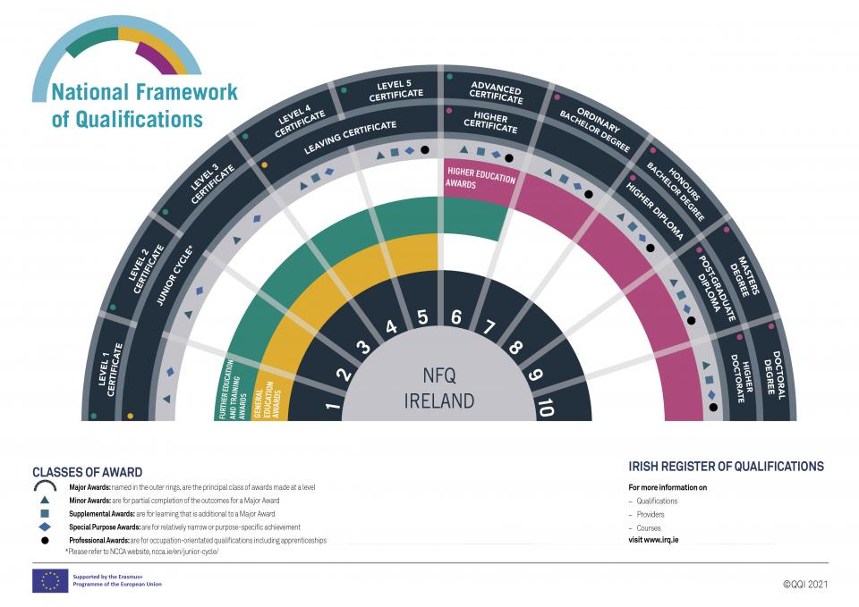
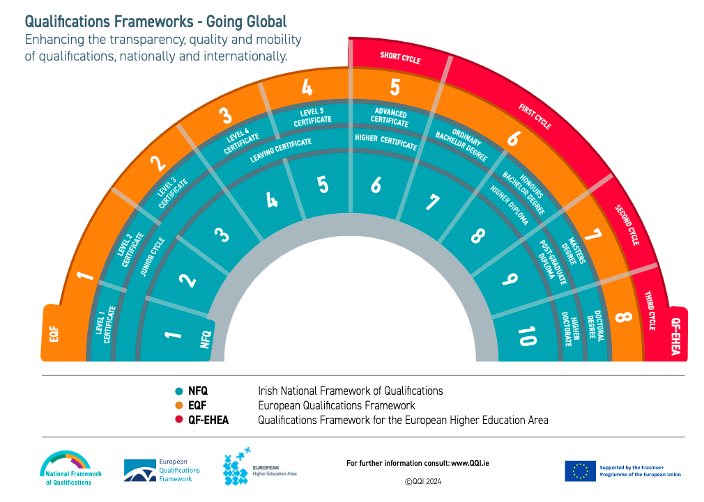

# หาที่เรียน / ทุน

การเรียนในไอร์แลนด์นานกว่า 90 วัน ไม่ว่าจะในระดับมหาวิทยาลัยหรือโรงเรียนภาษาอังกฤษ
จะต้องขอใบอนุญาตพำนัก

- สำหรับการเรียนในระดับมหาวิทยาลัย การจะขอใบอนุญาตพำนักได้
  จะต้องเลือกหลักสูตรจาก[รายการ Interim List of Eligible Programmes (ILEP)](https://www.irishimmigration.ie/coming-to-study-in-ireland/what-are-my-study-options/a-third-level-course-or-a-language-course/)
  เท่านั้น

- สำหรับการเรียนในโรงเรียนภาษาอังกฤษ การจะขอใบอนุญาตพำนักได้
  โรงเรียนภาษาอังกฤษจะต้องได้รับรองจาก
  [Accreditation and Co-ordination of English Language Services (ACELS)](https://www.acels.ie)
  - ปี 2024 เป็นช่วงเปลี่ยนผ่านไปสู่ระบบการรับรองคุณภาพแบบใหม่ที่ชื่อว่า
    [International Education Mark (IEM)](https://www.qqi.ie/what-we-do/quality-assurance-of-education-and-training/what-is-the-international-education-mark)
    หลังจากปีนี้ โรงเรียนภาษาอังกฤษที่จะรับนักเรียนจากนอกเขตเศรษฐกิจยุโรป (เช่นจากประเทศไทย)
    จะต้องมีตรา IEM

## NFQ

การหาหลักสูตรเรียน สามารถดูชั้นของหลักสูตรได้จากระดับ NFQ

- ระบบการศึกษาในไอร์แลนด์ทั้งหมด ทั้งสายสามัญและสายวิชาชีพ จะอยู่ภายใต้กรอบ
  [National Framework of Qualifications](https://www.qqi.ie/what-we-do/the-qualifications-system/national-framework-of-qualifications)
  ซึ่งมี 10 ระดับ
  - ในรายละเอียดทุกหลักสูตรจะมีบอกว่าหลักสูตรนี้ NFQ Level อะไร
  - การศึกษาที่เรียกว่า "Higher Education" หรืออุดมศึกษาในไอร์แลนด์ จะเริ่มตั้งแต่ระดับ 6
  - ระดับ 6 - **Advanced Certificate / Higher Certificate** เทียบเท่า ประกาศนียบัตรชั้นสูง (ปวส.) ของไทย
  - ระดับ 7 - **Ordinary Bachelor Degree** (โดยทั่วไปเรียน 3 ปี) เทียบเท่า ปริญญาตรีของไทย
  - ระดับ 8 - **Higher Diploma / Honour Bachelor Degree** (โดยทั่วไปเรียน 4 ปี) เทียบเท่า ปริญญาตรีของไทย
  - ระดับ 9 - **Post-Graduate Diploma / Masters Degree** ปริญญาโท
  - ระดับ 10 - **Doctoral Degree / Higher Doctorate** ปริญญาเอก
- NFQ 10 ระดับของไอร์แลนด์ สามารถเทียบกับ
  [European Qualifications Framework (EQF) 8 ระดับ ของสหภาพยุโรป](https://europass.europa.eu/en/europass-digital-tools/european-qualifications-framework) ได้ตามแผนภาพด้านล่างนี้
  ผู้จบการศึกษาจากระบบ NFQ/EQF (ประเทศในสหภาพยุโรป และอีก 11 ประเทศ
  รวมถึงนอร์เวย์ สวิตเซอร์แลนด์ และตุรกี)
  สามารถศึกษาต่อในระดับต่อไปในประเทศที่อยู่ภายใต้ NFQ/EQF เช่นกันได้ทันที

  

## รายชื่อสถาบันอุดมศึกษา

มหาวิทยาลัยทั้งหมดในไอร์แลนด์เป็นมหาวิทยาลัยรัฐ

- [Atlantic Technological University](https://www.atu.ie/) (ในเมือง Galway-Mayo, Sligo และ Letterkenny)

- [Dublin City University](https://www.dcu.ie/)
- [Munster Technological University](https://www.mtu.ie/) (ในเมือง Cork และ Tralee)

- [National University of Ireland](https://www.nui.ie/)
  - [Maynooth University](https://www.maynoothuniversity.ie/)
  - [University of Galway](https://www.universityofgalway.ie/)
  - [University College Cork](https://www.ucc.ie/)
  - [University College Dublin](https://www.ucd.ie/)
- [South East Technological University](https://www.setu.ie/) (ในเมือง Carlow และ Waterford)
- [Technological University Dublin](https://www.tudublin.ie/)
- [Technological University of the Shannon: Midlands Midwest](https://tus.ie/) (ในเมือง Athlone และ Limerick)
- [Trinity College Dublin](https://www.tcd.ie/) (University of Dublin)
- [University of Limerick](https://www.ul.ie/)
- [University of Medicine and Health Sciences](https://www.rcsi.com/) (Royal College of Surgeons in Ireland) (ในเมือง Dublin)

สถาบันอุดมศึกษาอื่น ทั้งของรัฐและเอกชน เช่น

- [Dundalk Institute of Technology](https://www.dkit.ie/)
- [Dún Laoghaire Institute of Art, Design and Technology (IADT)](https://iadt.ie/)
- [National College of Art and Design (NCAD)](https://www.ncad.ie/) (เป็น recognised college ของ University College Dublin)
- [The Lir National Academy of Dramatic Art](https://www.thelir.ie/) (เป็นส่วนหนึ่งของ Trinity College Dublin)
- [Gaiety School of Acting](https://gaietyschool.com/) (มีหลักสูตร [MA Theatre Practice](https://hub.ucd.ie/usis/!W_HU_MENU.P_PUBLISH?p_tag=PROG&MAJR=Z243) ร่วมกับ University College Dublin)
- [Burren College of Art](https://www.burrencollege.ie/) (มีหลักสูตร [MFA in Studio Art](https://www.universityofgalway.ie/courses/taught-postgraduate-courses/fine-art-studio-art.html) ร่วมกับ University of Galway)
- [Royal Irish Academy of Music](https://www.riam.ie/)
- [Mary Immaculate College](https://www.mic.ul.ie/) (วิทยาลัยด้านการศึกษาและศิลปศาสตร์ เป็นส่วนหนึ่ง University of Limerick)
- [Marino Institute of Education](https://www.mie.ie/) (เป็น associated college ของ Trinity College Dublin)
- [National College of Ireland](https://www.ncirl.ie/)
- [Dublin Business School](https://www.dbs.ie/)
- [Griffith College](https://www.griffith.ie/)
- [King's Inn](https://www.kingsinns.ie/) (โรงเรียนกฎหมายของเนติบัณฑิตยสภาไอร์แลนด์)

## ทุนการศึกษา / ทุนวิจัย

### เฉพาะไอร์แลนด์

- **[Government of Ireland – International Education Scholarships](https://hea.ie/policy/internationalisation/goi-ies/)**
- **[Irish Research Council](https://www.educationinireland.com/en/)**
- **[Science Foundation Ireland](https://www.sfi.ie/)**
- ทุนการศึกษา University College Dublin ร่วมกับ [มูลนิธิเทคโนโลยีสารสนเทศตามพระราชดำริสมเด็จพระเทพรัตนราชสุดา ฯ สยามบรมราชกุมารี](https://www.princess-it.org/scholarship/ucd/) (เฉพาะคนไทย)
- **[CareersPortal Scholarship Explorer](https://careersportal.ie/scholarships/)**
  - รวมทุนการศึกษา และส่วนลดค่าเล่าเรียน เน้นหลักสูตรวิชาชีพ
- ติดตามเว็บไซต์และสื่อสังคมของมหาวิทยาลัย คณะ ศูนย์วิจัย และอาจารย์ในสาขาวิชาต่างๆ
  ในมหาวิทยาลัย สำหรับข่าวสารทุนการศึกษา ทุนวิจัย และทุนวิจัยระยะสั้น ที่จะมีประกาศตลอดปี
- สำหรับผู้มีใบอนุญาตพำนักประเภท Stamp 4, Stamp 5, หรือ Stamp 6
  ที่พำนักในไอร์แลนด์มาแล้วไม่ต่ำกว่า 3 ปี สามารถสมัครเรียนหลักสูตรในโครงการ
  Springboard+ และโครงการ Human Capital Initiative Pillar 1 ของรัฐบาลได้ ทั้งนี้หลักสูตรทั้งหมด เรียนฟรี หรือมีส่วนลดสูงสุดถึง 90% มีทั้งหลักสูตรประกาศนียบัตร ปริญญาตรี และปริญญาโท ดูข้อมูลที่ [SpringboardCourses.ie](https://springboardcourses.ie/)

### ยุโรปและสหภาพยุโรป (รวมไอร์แลนด์ด้วย)

- **[Study in Europe](https://education.ec.europa.eu/study-in-europe/planning-your-studies/scholarships-and-funding)**
  - รวมทุนการศึกษา ทุนวิจัย และการสนับสนุนทางการเงินอื่นๆ จากหน่วยงานในสหภาพยุโรป
  - เลือกหน้า **[Ireland](https://education.ec.europa.eu/study-in-europe/countries/ireland)**
- **[EURAXESS ASEAN](https://euraxess.ec.europa.eu/worldwide/asean)**
  - รวมทุนวิจัยที่เป็นความร่วมมือระหว่างสหภาพยุโรปและอาเซียน
